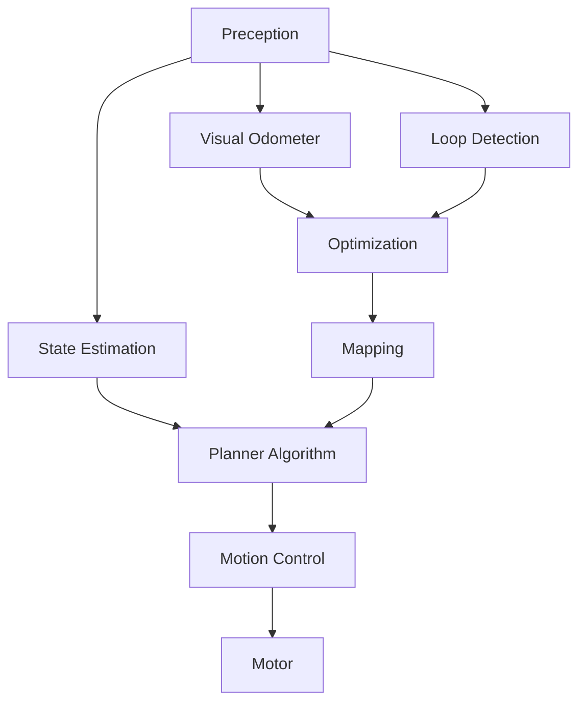
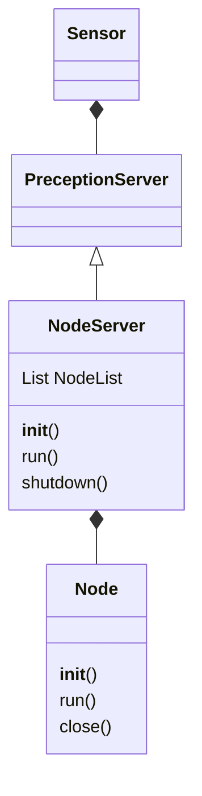
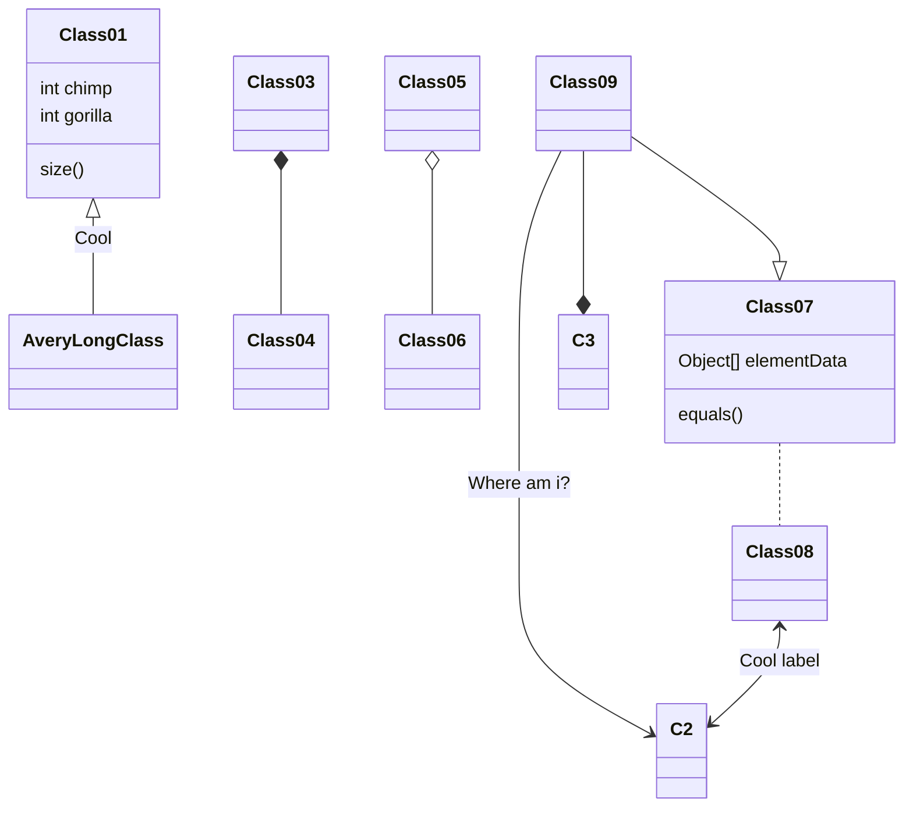

[toc]
# Framework

```mermaid
graph TB
    Preception[Preception] --> VO[Visual Odometer]
    VO --> Optimizer[Optimization]
    LoopDetection[Loop Detection] --> Optimizer
    Preception --> LoopDetection
    Optimizer[Optimization] --> Mapping[Mapping]
    Preception[Preception] --> StateEstimate[State Estimation]
    StateEstimate --> Planner[Planner Algorithm]
    Mapping --> Planner
    Planner --> Motion[Motion Control]
    Motion --> Motor[Motor]
```

# Node Server

```mermaid
classDiagram
NodeServer *-- Node
PreceptionServer <|-- NodeServer
Sensor *-- PreceptionServer
NodeServer : List NodeList
NodeServer : __init__()
NodeServer : run()
NodeServer : shutdown()
Node : __init__()
Node : run()
Node : close()
```

# Preception

```mermaid
classDiagram
Class01 <|-- AveryLongClass : Cool
Class03 *-- Class04
Class05 o-- Class06
Class07 .. Class08
Class09 --> C2 : Where am i?
Class09 --* C3
Class09 --|> Class07
Class07 : equals()
Class07 : Object[] elementData
Class01 : size()
Class01 : int chimp
Class01 : int gorilla
Class08 <--> C2: Cool label
```

